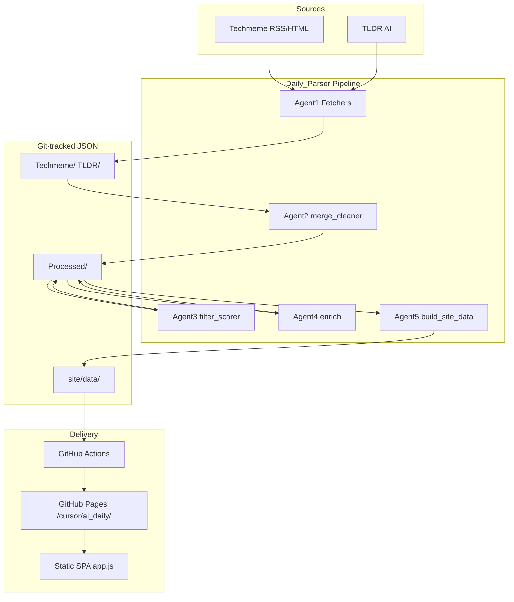

# AI Daily — Product & technical specification

**Language / 语言**: [English](PROJECT.md) · [中文](PROJECT.zh.md)

> Terminology matches the live UI (`app.js` `t(zh, en)` pairs) and workflow names.

---

## 1. Product positioning

**AI Daily** is a **Daily Brief** for AI product and engineering readers. Goals:

1. **Save time**: aggregate high-signal sources (TLDR AI, Techmeme, etc.) so you do not hop across sites.
2. **Scannable**: Chinese titles/summaries plus English source titles; browse by **Category**, **Tag**, and **Timeline**.
3. **Track progress**: browser **Read state** via `localStorage`; **Unread** / **All** filters; **Mark all read** / **Reset to unread** for the current view.
4. **Auditable**: **filter-report** JSON with per-item LLM **Score** and keep reasons.

**Live site**: https://koalafionagao-ai.github.io/cursor/ai_daily/

**Blog link**: header **← Blog** points to the author’s main site. The `cursor` repo can host multiple projects; AI Daily lives under `Daily_Parser/` and Pages path `ai_daily`.

---

## 2. Features

### 2.1 Desktop (≥769px)

| Area | Function |
|------|----------|
| Left **Timeline** | Fold years/months; open month **Hub** or day **Daily** view |
| Right **Filter** | This month’s **Categories** and **Tags** (unread/total counts) |
| Main **Dashboard** | Month unread/read counts; days/categories/tags with unread |
| Toolbar | **Unread** / **All**; **Mark all read** / **Reset to unread** (current view scope) |
| Cards | Open source link; **Mark read** / **Mark unread**; tag navigation |

### 2.2 Mobile (≤768px)

| Capability | Description |
|------------|-------------|
| Top **Time / Hub / Filter** | Pill buttons open bottom **Sheet** / **Drawer**; route context on tab subtitles |
| Toolbar | Embedded in top chrome; hides on scroll down with header (no empty gap) |
| Dashboard | Not inline in feed; only in **Hub** drawer (**Month dashboard**) |
| Language | **中文** / **En** toggle (including tab labels: Time, Hub, Filter) |

### 2.3 Read state

- Storage: `localStorage` key `ai-daily-state-v2`, explicit read per `date:id`.
- **Unread** = not explicitly marked read (no catch-up / last-visit logic).
- Bulk actions apply only to the **current view** (Hub = full month; Daily / Tag / Category = filtered list).

### 2.4 Hash routing

| URL example | View |
|-------------|------|
| `#/2026-06` | Month Hub |
| `#/2026-06/day/2026-06-02` | Daily list |
| `#/2026-06/tag/openai` | Tag filter |
| `#/2026-06/cat/cat:model` | Category filter |

---

## 3. Architecture

### 3.1 Stack

| Layer | Technology |
|-------|------------|
| Data pipeline | Python 3.11, `httpx` / `feedparser`, GitHub Models (LLM) |
| Site data | JSON (`manifest`, `daily/*`, `monthly/*`) |
| Frontend | Vanilla HTML / CSS / JS (no build step) |
| Deploy | GitHub Actions → GitHub Pages (`ai_daily` subpath) |
| State | Browser `localStorage` |

### 3.2 Directories

| Path | Role |
|------|------|
| `common/` | Dates, LLM batches, schema, `taxonomy.py` |
| `Processed/YYYY-MM/` | Per-day pipeline artifacts (below) |
| `site/data/` | **Publish contract** — frontend reads only this |
| `site/assets/app.js` | Routing, render, read state, mobile drawers |

---

## 4. Data pipeline

Brief date `YYYY-MM-DD` (default: **yesterday** in Asia/Shanghai).

### Agent1 — Fetch

| Script | Output |
|--------|--------|
| `techmeme_fetcher.py` | `Techmeme/techmeme_YYYY-MM-DD.json` |
| `tldr_fetcher.py` | `TLDR/tldr_ai_YYYY-MM-DD.json` |

Structured sections and items (title, link, excerpt, etc.).

### Agent2 — Merge & clean

**Script**: `merge_cleaner.py`

| Output | Meaning |
|--------|---------|
| `blocks_*.json` | Unified blocks with source IDs |
| `mapping_*.json` | Merge mapping |
| `prompt_*.txt` | Debug prompt (optional) |

Dedupe and normalize for scoring.

### Agent3 — Filter & score

**Script**: `filter_scorer.py`  
**Model**: smaller `MINI_MODEL` batches.

| Output | Meaning |
|--------|---------|
| `filter_*.json` | Per item: `score` 0–10, `keep`, `reason`; default `keep = score >= 7` |
| Copy | `site/data/filter-report/*.json` for review |

Only `keep=true` IDs go to enrichment.

### Agent4 — Enrich (translate & tag)

**Script**: `enrich.py`

| Output | Meaning |
|--------|---------|
| `processed_*.json` | Publish items: `title` / `summary` (zh/en), `tags`, `category_tag`, `url`, `source` |

Rules:

- English title/summary stay source-faithful;
- Chinese from LLM; empty Chinese summary if it duplicates the Chinese title;
- Tags normalized only via `taxonomy.py` allowlist.

### Agent5 — Site build

**Script**: `build_site_data.py`

1. Each `processed` → `site/data/daily/YYYY-MM-DD.json`
2. Monthly rollup → `site/data/monthly/YYYY-MM.json` (`tag_index`, `category_index`)
3. `site/data/manifest.json` (months, categories, `base_path`)

**Base path**: `/cursor/ai_daily/`

---

## 5. Frontend data contract

### manifest.json

- `months[]`, `days[]`, `categories[]`, `latest_date`
- `base_path`: prefix for static assets and JSON

### monthly JSON

- `items[]`: all month items (with `date`, `id`)
- `tag_index` / `category_index`: inverted indexes
- `tag_stats` / `category_stats`

### Item fields

| Field | Description |
|-------|-------------|
| `id` | Stable source id (e.g. `TM-01`) |
| `title.zh` / `title.en` | Title |
| `summary.zh` / `summary.en` | Summary (may be empty) |
| `url` | Source URL |
| `source` | `TLDR` / `Techmeme` |
| `tags` / `entity_tags` / `category_tag` | Tags and category |

---

## 6. Deployment

Repo name `cursor` → Pages root: `https://<user>.github.io/cursor/`

Workflow `deploy-pages.yml`:

1. Run `build_site_data.py`
2. Copy `Daily_Parser/site/` into artifact subdirectory **`ai_daily/`**
3. Root `index.html` redirects to `ai_daily/`

Public URL: **`/cursor/ai_daily/`** (subpath for multi-project repos).

---

## 7. Cleanup record

| Item | Action |
|------|--------|
| Root `site/` | Moved to `Daily_Parser/site/` |
| Root `reference.html` | `docs/reference-design.html` (not deployed) |
| `ai_translator.py` | **Removed** (use `enrich.py`) |
| `docs/TAGS.md` | Under `Daily_Parser/docs/` (now `TAGS.md` / `TAGS.zh.md`) |
| `status_log.txt` / `merge_status_log.txt` | `.gitignore` (runtime logs) |
| Legacy URL `…/cursor/#/…` | Use `…/cursor/ai_daily/#/…` |

**Kept for traceability**: `Processed/**/prompt_*.txt`, `filter-report`, raw `Techmeme/` / `TLDR/`, structured logs in `logs/pipeline/`.

### Pipeline logging (Agent1–Agent5)

Each workflow run writes English **Markdown** logs keyed by brief date (`YYYY-MM-DD.md`). Tables include:

| Section | Contents |
|---------|----------|
| Run overview | brief date, run ID, overall status, timing |
| GitHub automation | workflow file, job, cron schedule, manual trigger |
| Step summary | one row per agent step (status, duration, volume, result) |
| Step details | action, GitHub Actions step name, script/command, input/output paths, tools/secrets, metrics |

`index.md` rolls up status, published item count, and anomalies for quick scanning. In-run state uses gitignored `*.pipeline.json`; committed artifact is Markdown only.

---

## 8. Operations

| Task | How |
|------|-----|
| Run one day manually | Actions → **AI Daily Pipeline** → `date` = `YYYY-MM-DD` |
| Tune filter threshold | `filter_scorer.py` `DEFAULT_THRESHOLD` or workflow input |
| Backfill history | `backfill_processed.py` + `build_site_data.py` |
| Add tags | Edit `common/taxonomy.py`; adjust enrich prompt if needed |
| Refresh site data only | Run `build_site_data.py` locally or in CI |
| Inspect pipeline health | `Daily_Parser/logs/pipeline/index.md` and per-date `.md` under `YYYY-MM/` |
| Debug a failed run | `python3 finalize_pipeline_log.py --date YYYY-MM-DD` (prints Markdown log) |
| Regenerate Markdown log | `python3 regenerate_pipeline_log.py --date YYYY-MM-DD` (from legacy JSON/state) |

---

## 9. Related links

- Tags: [TAGS.md](TAGS.md) · [中文](TAGS.zh.md)
- Usage: [../README.md](../README.md) · [中文](../README.zh.md)
- Author blog: https://koalafionagao-ai.github.io/my_blogs/
