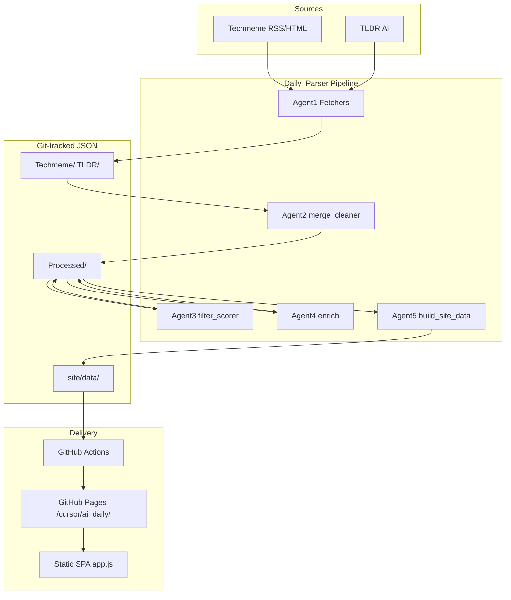

# AI Daily — 产品与技术说明

**Language / 语言**: [English](PROJECT.md) · [中文](PROJECT.zh.md)

> 重要术语保留中英对照，便于与代码、Workflow 名称对照；英文 UI 文案与线上一致（如 Unread、All、Time、Hub、Filter）。

---

## 1. 产品定位（Product）

**AI Daily** 是一份面向 AI 产品/研发从业者的**每日聚合简报（Daily Brief）**，目标：

1. **省时间**：从 TLDR AI、Techmeme 等高频源自动汇总，避免多站刷新闻。
2. **可扫读**：中文标题/摘要 + 英文原文标题；按**分类（Category）**、**标签（Tag）**、**日期（Timeline）**浏览。
3. **可追进度**：浏览器本地记录**已读（Read state）**，支持「未读 / 全部」筛选与批量已读/重置。
4. **可审计**：保留筛选报告（`filter-report`），每条有 LLM **分数（Score）** 与保留理由。

**线上入口**：https://koalafionagao-ai.github.io/cursor/ai_daily/

**与主博客关系**：顶栏「← Blog」链到作者主站；本仓库 `cursor` 下可同时存在多个子项目，AI Daily 独占 `Daily_Parser/` 目录与 Pages 子路径 `ai_daily`。

---

## 2. 用户功能说明（Features）

### 2.1 桌面端（Desktop, ≥769px）

| 区域 | 功能 |
|------|------|
| 左栏 **时间轴（Timeline）** | 年/月折叠；进入某月「面板（Hub）」、某日「日报（Daily）」 |
| 右栏 **筛选（Filter）** | 本月分类、标签列表（带未读/总数） |
| 主栏 **看板（Dashboard）** | 当月未读数、已读数、涉及天/分类/标签统计 |
| 工具栏 | **未读 / 全部**（Unread / All）；**当前全部已读** / **当前重置为未读**（Mark all read / Reset to unread，作用范围为当前视图） |
| 卡片 | 外链原文；标为已读/未读；标签跳转 |

### 2.2 移动端（Mobile, ≤768px）

| 能力 | 说明 |
|------|------|
| 顶栏 **时间 / 看板 / 筛选**（Time / Hub / Filter） | 胶囊按钮打开底部抽屉（Sheet/Drawer）；路由上下文显示在对应 tab 副标题 |
| 工具栏 | 与顶栏一体，随内容上滑隐藏，避免留白 |
| 看板 | 不在信息流内嵌，仅在「看板」抽屉 |
| 语言 | 中/En 切换（含顶栏 tab 文案） |

### 2.3 阅读状态（Read state）

- 存储：`localStorage` 键 `ai-daily-state-v2`，按 `date:id` 记录显式已读。
- **未读** = 未显式标记已读（无「追平/Catch-up」逻辑）。
- 批量操作仅影响**当前视图范围**内条目（Hub=整月，日报/标签/分类=过滤后列表）。

### 2.4 路由（Hash routing）

| URL 示例 | 视图 |
|----------|------|
| `#/2026-06` | 月面板 Hub |
| `#/2026-06/day/2026-06-02` | 某日列表 |
| `#/2026-06/tag/openai` | 标签筛选 |
| `#/2026-06/cat/cat:model` | 分类筛选 |

---

## 3. 技术架构（Architecture）

### 3.1 技术栈（Stack）

| 层级 | 技术 |
|------|------|
| 数据流水线 | Python 3.11、`httpx`/`feedparser`、GitHub Models（LLM） |
| 站点数据 | JSON（`manifest`、`daily/*`、`monthly/*`） |
| 前端 | 原生 HTML/CSS/JS（无构建步骤） |
| 部署 | GitHub Actions → GitHub Pages（子路径 `ai_daily`） |
| 状态 | 浏览器 `localStorage` |

### 3.2 目录与职责

| 路径 | 职责 |
|------|------|
| `common/` | 日期解析、LLM 批处理、Schema、标签词表 `taxonomy.py` |
| `Processed/YYYY-MM/` | 当日流水线产物（见下节） |
| `site/data/` | **发布契约**，前端只读此目录 |
| `site/assets/app.js` | 路由、渲染、已读、移动端抽屉 |

---

## 4. 数据处理流程（Data pipeline）

以简报日 `YYYY-MM-DD`（默认：北京时间**昨日**）为例。

### 4.0 GitHub Actions — 定时与步骤顺序

仓库里有 **两个** Workflow，**只有一个带 cron 定时**：

| Workflow | 文件 | 何时运行 | 作用 |
|----------|------|----------|------|
| **AI Daily Pipeline** | `.github/workflows/daily-pipeline.yml` | **Cron** `0 1 * * *` UTC（**北京时间约 09:00**）每日；或 **手动** `workflow_dispatch`（可选 `date`） | 对某一简报日跑 Agent1–5、写日志、提交产物 |
| **Deploy AI Daily to GitHub Pages** | `.github/workflows/deploy-pages.yml` | **无 cron** — Pipeline 完成后、或 `main` 推送涉及 `Daily_Parser/site/**`、或手动 | 再跑 `build_site_data.py`，发布静态站到 `/cursor/ai_daily/` |

**简报日规则**（Pipeline）：定时跑时 `date = 北京时间昨日`；手动跑时用输入的 `date`，未填则同上。

**同一次 Pipeline 任务内**，下列步骤 **按顺序依次执行**（不是多个独立定时任务）：

| 顺序 | GitHub Actions 步骤名 | 脚本 |
|------|----------------------|------|
| 0 | Resolve target date |（shell）|
| 0 | Install dependencies | `pip install -r Daily_Parser/requirements.txt` |
| 1 | Fetch Techmeme | `techmeme_fetcher.py` |
| 2 | Fetch TLDR AI | `tldr_fetcher.py` |
| 3 | Merge & clean (Agent2) | `merge_cleaner.py` |
| 4 | Filter score (Agent3) | `filter_scorer.py` |
| 5 | Enrich translate (Agent4) | `enrich.py` |
| 6 | Build site data (Agent5) | `build_site_data.py` |
| 7 | Finalize pipeline log | `finalize_pipeline_log.py` |
| 8 | Commit pipeline outputs | `git add` + commit + push |

### Agent1 — 抓取（Fetch）

| 脚本 | GitHub 步骤 | 输入 | 输出 | 工具 |
|------|-------------|------|------|------|
| `techmeme_fetcher.py` | Fetch Techmeme | Techmeme Mailchimp RSS（外网） | `Techmeme/techmeme_YYYY-MM-DD.json` | `feedparser`, `beautifulsoup4` |
| `tldr_fetcher.py` | Fetch TLDR AI | TLDR AI RSS（外网） | `TLDR/tldr_ai_YYYY-MM-DD.json` | `feedparser`, `beautifulsoup4` |

结构化章节 + 条目（标题、链接、摘要等）。

### Agent2 — 合并清洗（Merge & clean）

**脚本**：`merge_cleaner.py` · **GitHub 步骤**：Merge & clean (Agent2)

| 输入 | 输出 | 含义 |
|------|------|------|
| `Techmeme/techmeme_*.json`、`TLDR/tldr_ai_*.json` | `Processed/YYYY-MM/blocks_*.json` | 统一块结构，带源 ID |
| | `Processed/YYYY-MM/mapping_*.json` | URL / ID 映射 |
| | `Processed/YYYY-MM/prompt_*.txt` | 调试 Prompt（可选） |

去重、规范化字段，供下游打分。

### Agent3 — 筛选打分（Filter & score）

**脚本**：`filter_scorer.py` · **GitHub 步骤**：Filter score (Agent3)  
**模型**：偏小模型（`MINI_MODEL`）批量打分（GitHub Models API，见 `common/llm.py`）

| 输入 | 输出 | 含义 |
|------|------|------|
| `Processed/YYYY-MM/blocks_*.json` | `Processed/YYYY-MM/filter_*.json` | 每条 `score` 0–10、`keep`、`reason`；默认 `keep = score >= 7` |
| | `site/data/filter-report/*.json`（经 Agent5） | 便于对照的副本 |

仅 `keep=true` 的 ID 进入翻译。

### Agent4 — enrich（Translate & tag）

**脚本**：`enrich.py` · **GitHub 步骤**：Enrich translate (Agent4)  
**模型**：GitHub Models API（见 `common/llm.py`）

| 输入 | 输出 | 含义 |
|------|------|------|
| `blocks_*.json`、`mapping_*.json`、`filter_*.json` | `Processed/YYYY-MM/processed_*.json` | 发布条目：`title`/`summary` 中英、`tags`、`category_tag`、`url`、`source` |

规则：

- 英文标题/摘要保留原文；
- 中文由 LLM 生成；摘要与标题重复则中文摘要置空；
- 标签仅从 `taxonomy.py` 允许列表归一化。

### Agent5 — 站点构建（Site build）

**脚本**：`build_site_data.py` · **GitHub 步骤**：Build site data (Agent5)

| 输入 | 输出 |
|------|------|
| `Processed/YYYY-MM/processed_*.json` | `site/data/daily/YYYY-MM-DD.json` |
| `filter_*.json`（可选） | `site/data/filter-report/YYYY-MM-DD.json` |
| 全部 daily | `site/data/monthly/YYYY-MM.json`（`tag_index`、`category_index`） |
| | `site/data/manifest.json`（月份、分类、`base_path`） |

**Base path**：`/cursor/ai_daily/`

### 4.1 流水线日志模块（Pipeline logging）

**是什么**：`common/pipeline_log.py`，为 Agent1–5 生成结构化英文运行日志。

**作用**：追溯每步顺序、耗时、数据量、结果与异常，尽早发现「某天条数过少、某步失败」等问题。

**怎么做**：

1. 各 agent 脚本用 `PipelineLogger(brief_date).step(...)` 包裹主逻辑；
2. 记录 metrics（如 `news_count`、`kept`、`published_items`），标记 `success` / `warning` / `failed` / `skipped`；
3. Workflow 最后一步 `finalize_pipeline_log.py` 收尾并更新 `logs/pipeline/index.md`；
4. 提交到 Git 的是 Markdown：`logs/pipeline/YYYY-MM/YYYY-MM-DD.md`；同一次运行内的续写靠 gitignore 的 `*.pipeline.json`。

**日志文件结构**（单步脚本/文件映射见 §4.0 与各 Agent 表，日志内不再重复 Step details 附录）：

| 章节 | 内容 |
|------|------|
| Run overview | 简报日、run ID、状态、时间、发布量阈值 |
| GitHub automation | 哪个 Workflow 有 cron、部署触发方式、完整步骤顺序表 |
| Anomalies | 告警、失败、发布量过低 |
| Step summary | 每步一行：GitHub 步骤名、耗时、metrics、结果 |

**工具**：`finalize_pipeline_log.py`、`regenerate_pipeline_log.py`（从 state/旧 JSON 重建 Markdown）。

---

## 5. 前端数据契约（Frontend contract）

### manifest.json

- `months[]`、`days[]`、`categories[]`、`latest_date`
- `base_path`：静态资源与 JSON 前缀

### monthly JSON

- `items[]`：当月全部条目（含 date、id）
- `tag_index` / `category_index`：倒排索引
- `tag_stats` / `category_stats`

### 条目字段（Item）

| 字段 | 说明 |
|------|------|
| `id` | 源内稳定 ID（如 TM-01） |
| `title.zh` / `title.en` | 标题 |
| `summary.zh` / `summary.en` | 摘要（可空） |
| `url` | 原文链接 |
| `source` | TLDR / Techmeme |
| `tags` / `entity_tags` / `category_tag` | 标签与分类 |

---

## 6. 部署路径（Deployment）

仓库名 `cursor` → Pages 根 URL：`https://<user>.github.io/cursor/`

Workflow `deploy-pages.yml`：

1. 运行 `build_site_data.py`
2. 将 `Daily_Parser/site/` 复制到 artifact 的 **`ai_daily/`** 子目录
3. 根目录 `index.html` 重定向到 `ai_daily/`

最终站点：**`/cursor/ai_daily/`**（用户无法改仓库名时，通过子路径隔离多项目）。

---

## 7. 仓库清理记录（Cleanup）

以下已在收尾中处理，避免与当前产品混淆：

| 项 | 处理 |
|----|------|
| 根目录 `site/` | 已迁入 `Daily_Parser/site/` |
| 根目录 `reference.html` | 已移至 `docs/reference-design.html`（旧版静态稿，**不部署**） |
| `ai_translator.py` | **已删除**（旧入口，请用 `enrich.py`） |
| `docs/TAGS.md` | 已迁入 `Daily_Parser/docs/`（现分 `TAGS.md` / `TAGS.zh.md`） |
| `status_log.txt` / `merge_status_log.txt` | 加入 `.gitignore`（运行日志，非发布物） |
| 历史 URL `…/cursor/#/…` | 请改用 `…/cursor/ai_daily/#/…` |

**保留但非运行时依赖**：`Processed/**/prompt_*.txt`（排错）、`filter-report`（调阈值）、原始 `Techmeme/`/`TLDR/`（可追溯）、流水线日志 `logs/pipeline/`（见 §4.1）。

---

## 8. 扩展与运维（Operations）

| 任务 | 做法 |
|------|------|
| 手动跑某日 | Actions → AI Daily Pipeline → `date` 输入 `YYYY-MM-DD` |
| 调筛选阈值 | 修改 `filter_scorer.py` 的 `DEFAULT_THRESHOLD` 或 workflow 参数 |
| 补历史 | `backfill_processed.py` + `build_site_data.py` |
| 新增标签 | 编辑 `common/taxonomy.py`，必要时改 enrich Prompt |
| 仅刷新站点数据 | 本地或 CI 运行 `build_site_data.py` |
| 查看流水线健康 | `logs/pipeline/index.md` 或某日 `YYYY-MM/YYYY-MM-DD.md` |
| 调试失败运行 | `python3 finalize_pipeline_log.py --date YYYY-MM-DD` |
| 重建 Markdown 日志 | `python3 regenerate_pipeline_log.py --date YYYY-MM-DD` |

---

## 9. 相关链接

- 标签说明：[TAGS.zh.md](TAGS.zh.md) · [English](TAGS.md)
- 使用说明：[../README.zh.md](../README.zh.md) · [English](../README.md)
- 作者博客：https://koalafionagao-ai.github.io/my_blogs/
